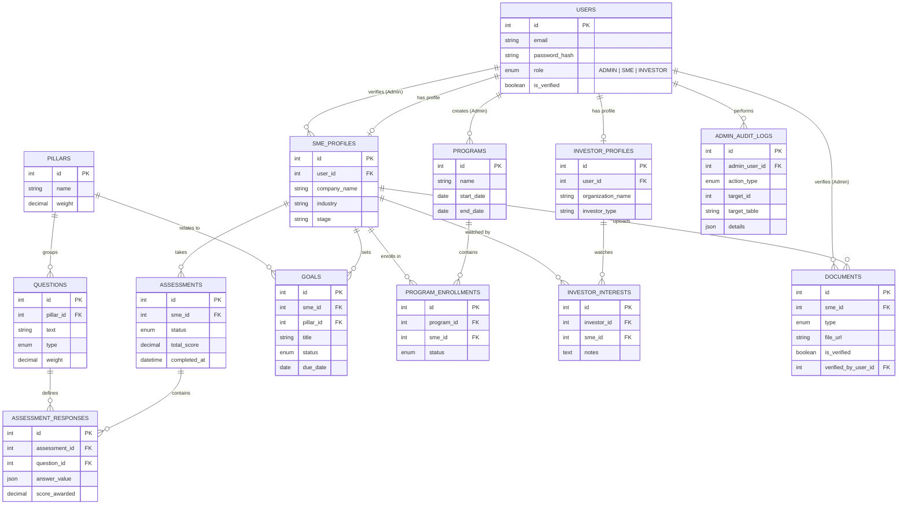

# Database Schema Diagram

This document contains a visual representation of the database schema using Mermaid.js syntax.

```mermaid
erDiagram
    %% Core Users & Profiles
    USERS ||--o| SME_PROFILES : "has profile"
    USERS ||--o| INVESTOR_PROFILES : "has profile"
    USERS {
        int id PK
        string email
        string password_hash
        enum role "ADMIN | SME | INVESTOR"
        boolean is_verified
    }

    SME_PROFILES {
        int id PK
        int user_id FK
        string company_name
        string industry
        string stage
    }

    INVESTOR_PROFILES {
        int id PK
        int user_id FK
        string organization_name
        string investor_type
    }

    %% Assessment Engine
    SME_PROFILES ||--o{ ASSESSMENTS : "takes"
    ASSESSMENTS ||--o{ ASSESSMENT_RESPONSES : "contains"
    PILLARS ||--o{ QUESTIONS : "groups"
    QUESTIONS ||--o{ ASSESSMENT_RESPONSES : "defines"

    PILLARS {
        int id PK
        string name
        decimal weight
    }

    QUESTIONS {
        int id PK
        int pillar_id FK
        string text
        enum type
        decimal weight
    }

    ASSESSMENTS {
        int id PK
        int sme_id FK
        enum status
        decimal total_score
        datetime completed_at
    }

    ASSESSMENT_RESPONSES {
        int id PK
        int assessment_id FK
        int question_id FK
        json answer_value
        decimal score_awarded
    }

    %% Goals & Progress
    SME_PROFILES ||--o{ GOALS : "sets"
    PILLARS ||--o{ GOALS : "relates to"

    GOALS {
        int id PK
        int sme_id FK
        int pillar_id FK
        string title
        enum status
        date due_date
    }

    %% Programs
    PROGRAMS ||--o{ PROGRAM_ENROLLMENTS : "contains"
    SME_PROFILES ||--o{ PROGRAM_ENROLLMENTS : "enrolls in"

    PROGRAMS {
        int id PK
        string name
        date start_date
        date end_date
    }

    PROGRAM_ENROLLMENTS {
        int id PK
        int program_id FK
        int sme_id FK
        enum status
    }

    %% Interactions
    INVESTOR_PROFILES ||--o{ INVESTOR_INTERESTS : "watches"
    SME_PROFILES ||--o{ INVESTOR_INTERESTS : "watched by"
    SME_PROFILES ||--o{ DOCUMENTS : "uploads"

    INVESTOR_INTERESTS {
        int id PK
        int investor_id FK
        int sme_id FK
        text notes
    }

    DOCUMENTS {
        int id PK
        int sme_id FK
        enum type
        string file_url
        boolean is_verified
        int verified_by_user_id FK
    }

    %% Admin & System Management
    USERS ||--o{ ADMIN_AUDIT_LOGS : "performs"
    USERS ||--o{ PROGRAMS : "creates (Admin)"
    USERS ||--o{ DOCUMENTS : "verifies (Admin)"
    USERS ||--o{ SME_PROFILES : "verifies (Admin)"

    ADMIN_AUDIT_LOGS {
        int id PK
        int admin_user_id FK
        enum action_type
        int target_id
        string target_table
        json details
    }
```
